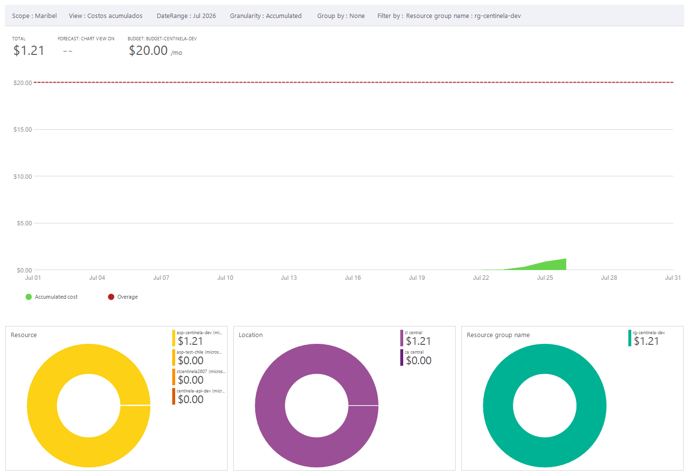

# Informe de Disponibilidad de Cómputo, Cuotas y Consumo de Azure

## Proyecto

**Centinela** – Sistema de detección de fraude transaccional

---

# Objetivo

Documentar el estado de las cuotas disponibles en Azure, el consumo de recursos realizado durante el Sprint 1 y la decisión tomada respecto a la región utilizada para el despliegue de la infraestructura.

---

# Contexto

Inicialmente la infraestructura iba a ser desplegada utilizando la suscripción **Azure for Students** perteneciente a otro integrante del equipo.

Durante las pruebas de aprovisionamiento se encontró que dicha suscripción presentaba restricciones de cuota para recursos de cómputo, impidiendo la creación del **App Service Plan (B1)** en la región inicialmente seleccionada (**Canada Central**).

Posteriormente se decidió utilizar una **suscripción Azure Subscription 1**, donde se validó la disponibilidad de recursos y se realizaron nuevamente las pruebas de aprovisionamiento.

---

# Problema encontrado

Al intentar crear el App Service Plan se obtuvo el siguiente error:

> **Operation cannot be completed without additional quota**
>
> Current Limit (Total VMs): 0

Este mensaje indica que la región no disponía de capacidad suficiente para crear recursos de cómputo dentro de la suscripción utilizada inicialmente.

---

# Cambio de región

Después de validar diferentes regiones disponibles, se seleccionó **Chile Central**, donde fue posible crear correctamente todos los recursos necesarios para el Sprint 1.

La infraestructura quedó desplegada en la siguiente región:

| Recurso | Estado |
|----------|--------|
| Región | Chile Central |
| Resource Group | Creado |
| Virtual Network | Creada |
| Subredes | Creadas |
| Storage Account | Creada |
| Blob Container | Creado |
| Storage Queue | Creada |
| App Service Plan B1 | Creado |
| Web App | Creada |
| Managed Identity | Configurada |
| Integración con VNet | Configurada |

---

# Disponibilidad del reconocimiento documental

Durante el Sprint 1 no fue necesario desplegar el servicio **Azure AI Document Intelligence**, ya que el reconocimiento documental hace parte de fases posteriores del proyecto.

Sin embargo, se verificó que el cambio de región realizado permite continuar con el despliegue de los servicios planificados para los siguientes sprints.

---

# Servicios con cuota cero

Durante la investigación se identificó la siguiente restricción:

| Servicio | Región | Resultado |
|----------|---------|-----------|
| App Service Plan (B1) | Canada Central | Sin cuota disponible para cómputo |
| App Service Plan (B1) | Chile Central | Disponible |

No se identificaron restricciones adicionales para los recursos utilizados durante el Sprint 1 en la región Chile Central.

---

# Consumo de recursos

Se configuró un presupuesto mensual de **USD 20**, junto con alertas de consumo para facilitar el seguimiento de los costos del proyecto.

Al finalizar el Sprint 1 el consumo acumulado corresponde aproximadamente a **USD 1.21**, manteniéndose muy por debajo del presupuesto establecido.

> **Figura 1. Consumo acumulado de recursos en Azure**

---

# Conclusiones

- Se verificó la disponibilidad de recursos de cómputo para el proyecto.
- Se identificó una restricción de cuota en la suscripción y región inicialmente utilizadas.
- Se migró el despliegue a una suscripción con disponibilidad de recursos.
- Se cambió la región de despliegue a **Chile Central**, donde la infraestructura pudo aprovisionarse correctamente.
- Se configuró un presupuesto de costos con sus respectivas alertas.
- La infraestructura del Sprint 1 quedó completamente desplegada y lista para continuar con el desarrollo y posterior despliegue de la API de ingesta.